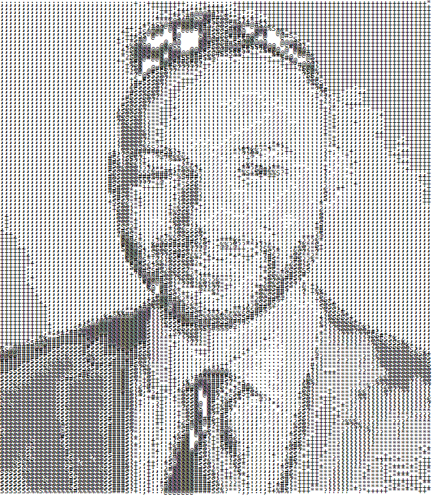

# ASCII Art
> A simple program that turns images into ASCII-art

## Instructions:

1. Open the index.html file in your web browser.

2. Use the file input to upload an image from your device.

3. The script will automatically:

- Convert the uploaded image to ASCII art.
- Display the ASCII art in the browser.
- Initiate a download of the ASCII art as a `.txt file` named `ascii_art.txt`.

Note: The conversion details, such as character mapping and dimensions, are handled within the script. There is no need to manually set configurations. The script dynamically calculates the necessary parameters based on the uploaded image.

4. (Optional) If you want to adjust the conversion settings, you can modify the following variables at the beginning of the `convertToAscii.js` script:
- `width`: Adjusts the width of the ASCII art (default is set in the script).
- `asciiChars`: A string of characters used to represent the image in ASCII form, from darkest to lightest (default is set in the script).

## Example
Original Image:

ASCII Image:

Enjoy your ASCII art!
